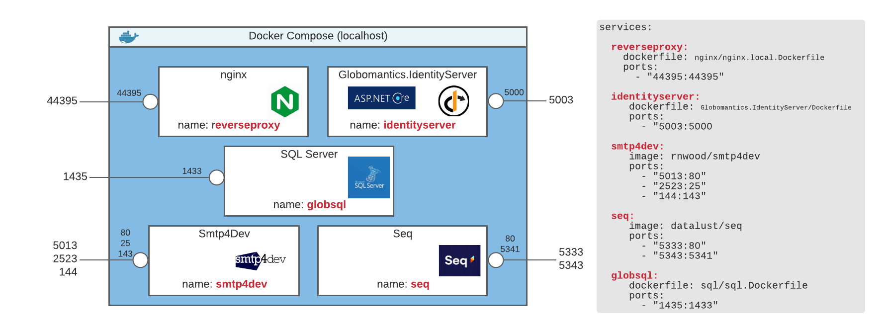

# Secure Authentication with IdentityServer4
This repository takes the authentication code and practices shown in my 
[Secure Authentication](https://github.com/dahlsailrunner/secure-authentication) repo (which was the code shown in my [Secure User Account and Authentication Practices in ASP.NET and ASP.NET Core](https://app.pluralsight.com/library/courses/secure-account-authentication-practices-asp-dot-net-core) Pluralsight course) and moves
it into an [IdentityServer4](https://identityserver4.readthedocs.io/en/latest/) project and runs it via Docker Compose.

# Getting Started
To run everything (notes below):
* Clone this repo
* Make sure you have the prerequisites below handled
* Run the `docker-compose` and `Globomantics.Core` projects in the solution

## Prerequisites:
* Make sure you have [Docker Desktop](https://www.docker.com/products/docker-desktop) installed.
* You need to have something to work with ASP.NET Core projects (like [Visual Studio](https://visualstudio.microsoft.com/), [VS Code](https://code.visualstudio.com/), or [JetBrains Rider](https://www.jetbrains.com/rider/)).
* **IMPORTANT!!** You need a `HOSTS` file entry on your machine for `id-local.globomantics.com` that refers to `127.0.0.1` (your localhost) 
* **IMPORTANT!!** Import the `src/nginx/id-local.pfx` file into the Trusted Root Certification Authorities store on your machine.  This is probably as simple as double-clicking the file in a file explorer and then choosing to add it into the correct store.

## Running the Projects
The solution contains two projects that should be run for full functionality.  You can either right-click on the solution and `Set Startup Projects` and choose both of them (this may differ based on your IDE), or just start both projects independently by debugging both of them.

* `docker-compose`: This project runs the IdentityServer4 instance with all of the ASP.NET Identity functionality from the other repo integrated with it.  When running, all of the items here should be available:

    * **IdentityServer4:**  https://id-local.globomantics:44395 is a welcome page with some links
    * **SQL Server Developer Edition:** `localhost,1435` is the server name you would use when connecting to the database from your workstation via [SQL Server Management Studio (SSMS)](https://docs.microsoft.com/en-us/sql/ssms/download-sql-server-management-studio-ssms?view=sql-server-ver15) or any other means.
    * **Mail browser:** http://localhost:5013 is an email browser that will show any email verification or password reset emails sent by the application (provided by the [rnwood/smpt4dev Docker image](https://github.com/rnwood/smtp4dev))
    * **Seq:** http://localhost:5333 is a Seq instance where all log entries from the IdentityServer are written.

* `Globomantics.Core`: This is the ASP.NET Core project that has had the ASP.NET Identity *removed* from it and moved into the IdentityServer4 project.  This **does not** run in `docker-compose` but rather is simply exposed via IIS Express or other local web server at https://localhost:44320  

**NOTE:** If you ASLO wanted to run the `Globomantics.Core` project within the `docker-compose` project, that would work, too.  You would add another top level item to the `docker-compose.yml` file, figure out how you want to address the site (dns name, https, etc) and then make additions to the nginx configuration.

# Licensing Notes
SQL Server and Seq are both licensed pieces of software that are used in this project with their free versions (SQL Server Developer Edition and Seq Free for development).  

# Database Notes
The original Globomantics user database was a local SQL Server Express database in the other repo and in the Pluralsight course mentioned above.  

The IdentityServer4 allows for its configuration and operational data to be stored in a database, which is a very common scenario and I wanted to show it here.

All of the files to get the database set up and running within Docker are in the `src/sql` folder.  Here are notes on the files used:

* `sql.Dockerfile`: This references the base `mcr.microsoft.com/mssql/server` image and also copies the other files from the `src/sql` directory into the container, and runs the `entrypoint.sh` file as its `CMD` which will start SQL Server and get things set up.
* `entrypoint.sh`: This bash script runs `sqlservr` and ALSO runs the `setup.sh` script against it
* `setup.sh`: This bash script uses the `wait-for-it.sh` script that will monitor `globsql` on port 1433 until it responds, then waits another 2 seconds to ensure SQL Server is running, and finally runs the `InitializeGlobomanticsDbAndUser.sql` script against the database.  Note that this references the `SA_PASSWORD` environment variable, which is set in the `docker-compose.yml` file (notes below)
* `wait-for-it.sh`: This script comes from a [GitHub repo](https://github.com/vishnubob/wait-for-it) and was mentioned in the Docker blog and simply monitors a host and port for availalbility and provides some options.
* `InitializeGlobomanticsDbAndUser.sql`: This script contains all of the logic to create the Globomantics database, add some rows to various tables, and then set up a SQL Server user account that we can use when connecting to the database from the application.  If you were following along from the other repo or Pluralsight course, all of the database changes that were made throughout that repo and course are consolidated into this single setup file which has the "end state" of the schema that we will use.  

### Database setup in Docker compose
The yaml from the `docker-compose.yml` file that relates to the database is shown below.

```yaml
globsql:
  build:
    context: .
    dockerfile: sql/sql.Dockerfile
  networks:
    - gateway
  environment:
    - ACCEPT_EULA=Y
    - SA_PASSWORD=Sqlc0nt*inersFTW!
  ports:
    - "1435:1433"      
```
In the above, the name of the container within the docker compose environment will be `globsql`.  The container that will be built is defined as `sql.sql.Dockerfile` which is described above, and uses the base `mssql/server` image from Microsoft and then adds our custom schema and data to it.

The environment variables are set which establish the MSSQL_SA_PASSWORD (used elsewhere) and also that accept the end-user license agreement (EULA).

Finally, SQL Server uses port 1433 by default, but you may have SQL Express or something else already on your host that uses that, so 1435 is the HOST port for this SQL Server instance and it will be forwarded to port 1433 in the docker compose environment. 

Server name when connecting from the host: `localhost,1435`
Server name when connecting from inside docker compose: `globsql` (no need to specify default port of 1433) 

### `appsettings.json` Connection Strings
Based on the above info, it shouldn't surprise you to see these connection strings in the `appsettings.json` files for the two applications (note the differences in the `Server` setting):

**Globomantics.IdentityServer** (runs inside `docker-compose`)
```json
"ConnectionStrings": {
    "IS4DbConnection": "Server=globsql;Database=GlobomanticsIdSrv;User Id=sa;Password=Sqlc0nt*inersFTW!;MultipleActiveResultSets=true",
    "GlobomanticsDb": "Server=globsql;Database=Globomantics;User Id=globo_identityserver;Password=SqlonLinux?!;MultipleActiveResultSets=true"
  },
```
**Globomantics.Core** (runs outside the compose environment)
```json 
"ConnectionStrings": {
    "GlobomanticsDb": "Server=localhost,1435;Database=Globomantics;User Id=globo_identityserver;Password=SqlonLinux?!;MultipleActiveResultSets=true"    
  },
```

# Docker Compose Notes
The `docker-compose.yml` file defines all of the services we want running when we run the docker compose project (which does a `docker-compose up` command and hooks in the debugger).  They are:

* `reverseproxy`: This is an nginx image that provides the SSL termination and routing to our IdentityServer and it listens on port 44395.  It has an alias of `id-local.globomantics.com` which routes traffic to it if other containers in this compose environment refer to that name.  More notes on that below.
* `identityserver`: This is our custom IdentityServer4 instance and it is defined by  `Globomantics.IdentityServer/Dockerfile`.  It exposes port 5003 on the host and listens on 5000 internally in the compose environment.  Note also that it has dependences on the other services here (the `depends_on` node).
* `smpt4dev`: This is the SMTP server and mail viewer mentioned above.
* `seq`: This is the Seq instance that we write log entries to from the IdentityServer project.
* `globsql`: This is the SQL Server database that was described above.

All of the above items use a network defined here called `gateway` (name doesn't matter) just so it's easy for them all to talk to one another.  

Here is a visual representation of the `docker-compose` environment along with an abbreviated version of the yaml file:



# nginx / Reverse Proxy / SSL notes
As noted above in the Docker Compose notes, the `reverseproxy` is one of the services defined.  Here's the yaml for it:

```yaml
reverseproxy:
  build:
    context: .
    dockerfile: nginx/nginx.local.Dockerfile
  networks:
    gateway:
    aliases:
        - "id-local.globomantics.com"   
  restart: always
  ports:
    - "44395:44395"    
```
An important point here is that any OIDC/OAuth2 server should have a defined "Issuer" or "Authority" value, and we would want that to be the same whether it is referred to from inside or outside the container/compose environment.

So we use the same port (44395) both inside and outside the compose world.  We also provide 
an `alias` that is the dns name we are defining for the IdentityServer.

And the Dockerfile that defines the container is `nginx/nginx.local.Dockerfile.`

```Dockerfile
FROM nginx

COPY nginx/nginx.local.conf /etc/nginx/nginx.conf
COPY nginx/id-local.crt /etc/ssl/certs/id-local.globomantics.com.crt
COPY nginx/id-local.key /etc/ssl/private/id-local.globomantics.com.key
```
This is really simple and just copies the `conf` file (see below) and SSL certificate files from the `nginx` folder into the container at specific locations that nginx uses.

The creation of these certs is what enables SSL on the site, and I've defined the steps I followed with `openssl` to create the certs in the following gist:

https://gist.github.com/dahlsailrunner/679e6dec5fd769f30bce90447ae80081

If you want to use a different DNS name you should be able to follow the steps in the gist and then get different certificates.

The PFX needs to be installed as a trusted root certificate on your host if you will be accessing a site from the browser on your host.

The remaining points of interest here are all in the `nginx.local.conf` file, and I've got an abridged version shown below.

```conf
http {
    ...

    upstream identity {
        server identityserver:5000;
    }        

    server {        
        listen 44395 ssl;

        ssl_certificate /etc/ssl/certs/id-local.globomantics.com.crt;
        ssl_certificate_key /etc/ssl/private/id-local.globomantics.com.key;

        server_name id-local.globomantics.com;        
        
        location / {
            proxy_pass         http://identity;
            ...
            proxy_set_header   Host $host:44395;
            proxy_set_header   X-Real-IP $remote_addr;
            proxy_set_header   X-Forwarded-For $proxy_add_x_forwarded_for:$server_port;
            proxy_set_header   X-Forwarded-Proto $scheme;
            proxy_set_header   X-Forwarded-Host $server_name:$server_port;
            ...
        }
    }
}
```
The `upstream` node defines a name used later in the file, and its `server` refers to the named service (and port) from the `docker-compose` file that you are routing traffic to.

The `server` listen on port 44395 as SSL - and this port was defined in the `docker-compose` file on the `reverseproxy` service.  The certificate files we copied into the image are referenced here to complete the SSL binding and the `server_name` defines the dns name used for the service.

Then the `location` subnode will take all traffic and route it to the `identity` upstream item that was defined above.  It also sets a few important headers that are needed inside the target application.

There are other values / settings in this file and they are important, but these are the ones that really connect the moving parts.

You could define additional servers and upstreams, or different locations to route things differently. 

# IdentityServer4 Notes
Start with an ASP.NET Core website of some sort.  Then add the following packages:

* `IdentityServer4`
* `IdentityServer4.AspNetIdentity`
* `IdentityServer4.EntityFramework`

There is a [good walkthrough on the IdentityServer4 documentation site](https://identityserver4.readthedocs.io/en/latest/quickstarts/0_overview.html) that starts with an overview and builds it up to be using ASP.NET Identity.

## Startup.cs
The `Startup.cs` file of this program is a lot like the one in the original repo mentioned above.

It adds Authentication, IdentityCore and all of the customization that is in place in the other repo.

But it **also** adds the following block of code in `ConfigureServices`:

```csharp
var connStr = Configuration.GetConnectionString("IS4DbConnection");
var migrationsAssembly = typeof(Startup).GetTypeInfo().Assembly.GetName().Name;
services.AddIdentityServer(options =>
{
    options.Events.RaiseErrorEvents = true;
    options.Events.RaiseInformationEvents = true;
    options.Events.RaiseFailureEvents = true;
    options.Events.RaiseSuccessEvents = true;

    options.AccessTokenJwtType = string.Empty;
    options.EmitStaticAudienceClaim = true;
    options.UserInteraction.LoginUrl = "/Account/Login";
})
.AddConfigurationStore(options =>
{
    options.ConfigureDbContext = b =>
        b.UseSqlServer(connStr, sql => sql.MigrationsAssembly(migrationsAssembly));
})
.AddOperationalStore(options =>
{
    options.ConfigureDbContext = b =>
        b.UseSqlServer(connStr, sql => sql.MigrationsAssembly(migrationsAssembly));
})
.AddDeveloperSigningCredential()
.AddAspNetIdentity<CustomUser>();
```

The above code sets up IdentityServer4 and uses EntityFramework for its data stores.  You can consult the documentation to explore other setup options and configuration that you might want/need to apply.

An important addition here is the `AddAspNetIdentity<CustomUser>` call at the bottom of the list.  This will put our own custom ASP.NET Identity functionality at play inside IdentityServer.

## Initial Data / Configuration
In addition to the `UseIdentityServer()` call there are a couple of other interesting things in the `Configure` method of `Startup.cs`.

```csharp
app.ApplyDatabaseSchema();
app.PopulateDatabaseIfEmpty();

var forwardedHeaderOptions = new ForwardedHeadersOptions
{
    ForwardedHeaders = ForwardedHeaders.XForwardedFor | ForwardedHeaders.XForwardedProto
};
forwardedHeaderOptions.KnownNetworks.Clear();
forwardedHeaderOptions.KnownProxies.Clear();
app.UseForwardedHeaders(forwardedHeaderOptions);
```
The first two lines above perform the EntityFramework migrations and add initial configuration data for the IdentityServer.

The "ForwaredHeaders" stuff is all about running this behind the nginx reverse proxy.

The `ApplyDatabaseSchema()` method is defined in `Initialization/MigrationHelper.cs` and simply applies the migrations to the database (creates all of the schema).

The `PopulateDatabaseIfEmpty()` method is in the `Initialization/InitialConfiguration.cs` file and has logic to set up all initial configuration for the IdentityServer -- mostly based on its [public demo](https://demo.identityserver.io/).

A key block is this one that defines the client for the Globomantics Core app (note the redirect uris and the `glob_profile` scope):
```csharp
new Client
{
    ClientId = "interactive.confidential",
    ClientName = "Interactive client (Code with PKCE)",

    RedirectUris = { "https://localhost:44320/signin-oidc" },
    PostLogoutRedirectUris = { "https://notused" },

    ClientSecrets = { new Secret("secret".Sha256()) },

    AllowedGrantTypes = GrantTypes.CodeAndClientCredentials,
    AllowedScopes = { "openid", "profile", "glob_profile", "email", "api", "api.scope1", "api.scope2", "scope2" },
    AllowOfflineAccess = true,
    RefreshTokenUsage = TokenUsage.ReUse,
    RefreshTokenExpiration = TokenExpiration.Sliding
},
```

That `glob_profile` scope is defined in the `GetIdentityResources` method and has the two custom claims defined in our custom `IUserClaimStore`:

```csharp
new IdentityResource("glob_profile", new List<string>{"MfaEnabled", "CompanyId", JwtClaimTypes.Role})
```

The `Controllers` and the `Views` are pages within IdentityServer and need to agree with your `IdentityUser` -- whatever that happens to be (`CustomUser` in our case).  The content from these folders comes largely from the Quickstarts of IdentityServer4.

All of the code in the `Areas` folder is the customized pages from ASP.NET Identity (this was explored in the Pluralsight course and exists in the original repo mentioned above).

# Globomantics.Core Notes
For the most part, this project just got smaller.

## Startup.cs
Instead of all of the ASP.NET Identity wire-up here, that has been moved into a centralized IdentityServer.  So all we need to do is add the OpenId Connect information for us to use.

Here's the critical block of code from `ConfigureServices` and some notes are below.

```csharp
services.AddAuthentication(options =>
{
    options.DefaultScheme = CookieAuthenticationDefaults.AuthenticationScheme;
    options.DefaultChallengeScheme = "oidc";
})
.AddCookie(options =>
{
    options.Cookie.Name = "mvccode";
    options.AccessDeniedPath = "/AccessDenied";
})
.AddOpenIdConnect("oidc", options =>
{
    options.Authority = "https://id-local.globomantics.com:44395";

    options.ClientId = "interactive.confidential";
    options.ClientSecret = "secret";

    options.ResponseType = "code";
    options.UsePkce = true;

    options.Scope.Clear();
    options.Scope.Add("openid");
    options.Scope.Add("profile");
    options.Scope.Add("glob_profile");
    options.Scope.Add("api");
    options.Scope.Add("offline_access");

    options.GetClaimsFromUserInfoEndpoint = true;
    options.SaveTokens = true;

    options.ClaimActions.MapJsonKey("MfaEnabled", "MfaEnabled");
    options.ClaimActions.MapJsonKey("CompanyId", "CompanyId");
    options.ClaimActions.MapJsonKey("role", "role");

    options.TokenValidationParameters = new TokenValidationParameters
    {
        NameClaimType = JwtClaimTypes.Name,
        RoleClaimType = JwtClaimTypes.Role
    };
    options.Events = new OpenIdConnectEvents
    {
        OnTicketReceived = e =>
        {
            e.Principal = DoClaimsTransformation(e.Principal);
            return Task.CompletedTask;
        }
    };
});
```
The `ClientId` needs to agree with the the configuration that exists in the `Initialization/InitialConfiguration.cs` of the IdentityServer described above.

Note the inclusion of the `glob_profile` in the requested scopes.  

**IMPORTANT!** Also note the `MapJsonKey` items in the above code that refer to the custom claims that we defined in our `IUserClaimStore`.  This will ensure that those claims are on the User principal that we refer to in the authorization policies in this application.

The `DoClaimsTransformation` method that I've defined is just some simple logic that shows how you could add claims to THIS APPLICATION that aren't coming from the IdentityServer.

## Custom Account Pages
I removed all of the `Areas/Identity/Account` files from this project and put them in the IdentityServer project.

## Login / Logout Pages
If you have at `Pages/Shared/_LoginPartial.cshtml`, you will find that it changed a bit from what was in the original code.

Here's the entire file:
```html
<div class="sign-in col-md-2">
    <span class="dvider"></span>
    <div class="sign">
        @if (User.Identity.IsAuthenticated)
        {
            <li class="dropdown">
                <a href="#" class="dropdown-toggle" data-toggle="dropdown" role="button" 
                   aria-haspopup="true" aria-expanded="false">@User.Identity.Name <span class="caret"></span></a>
                <ul class="dropdown-menu">
                    <li><a href="https://id-local.globomantics.com:44395/Identity/Account/Manage/Index">Manage Account</a>
                    <li role="separator" class="divider"></li>
                    <li><a asp-page="/Logout">Logout</a></li>

                </ul>
            </li>
        }
        else
        {
            <a asp-page="/Login">
                
                Sign-in
            </a>
        }
    </div>
</div>
```

It just has links to new (simpler) Login/Logout pages and a link to manage the account.

These pages leverage the standard OIDC challenge / signout methods.